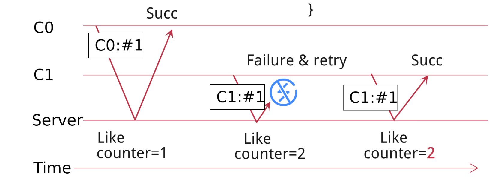
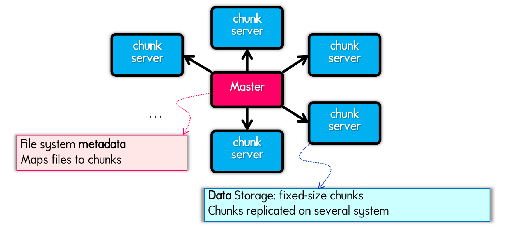

# FileSystem

## inode-fs

## FAT fs

# RPC

## Why RPC

Allow a procedure execute in another address space without coding the details for the remote interaction

**RPC vs. socket**

socket deeply rooted in application, unbinding is needed.

RPC is similar to PC which provided by remote server 

**Stub replace non-semantic web communication**

## RPC impl

**Using marshal?**: Serialize! How to queue pointed data properly

**RPC request:**

- Xid (X: transaction)
- call/reply
- rpc version
- **program #**
- program version
- **procedure #**
- auth stuff
- **arguments**

**RPC reply:**

- Xid
- call/reply
- accepted? (Yes, or No due to bad RPC version, auth failure, etc.)
- auth stuff
- success? (Yes, or No due to bad prog/proc #, etc.)
- **results**

## Data Encoding

**Design Rules**

- Compatible: different devices
- Evolvable: version compatible 

**Some solution**

- json/xml: readable, but low efficiency
- Java's java.io.Serializable: only java

**Protocol Buffer & Thrift**

super light binary format, ignore field name!

## Failure Handler

dilemma: web service failure

### RPC semantic

we need exactly once

**at least once:**

- retry many times

**at most once:**

- idempotence: x=1;non-idempotence: x++

### Impl

- Client retry if timeout

- For non-idempotence move, maintain a counter in server.

# DFS

## Why use DFS to access remote file

Inside stub, there must be efficient way

- Using mainly **file copy**: FTP, telnet...
- remote access model: transparent and diskless

NFS implements features of remote access, but with a lot optimization

## DFS impl

Similar to inode API

**Abstraction**

- server share specific local file

- client mount ip:/path/to/file

### No open and close in NFS

open and close need to be maintained by client -> keep RPC server **stateless**, avoiding failure

### What's in fh

- filename: cannot handle rename
- inode number: what if a file is updated

Use inode number & generation number

### Performance Overhead

Server FS performance & **Network Speed**

- use client cache to reduce network cost
  - filedata
  - metadata
  - pathname - inode binding

**Caching**

- close-to-open consistency: 
  - **Flush** the cache upon close
  - **Mark dirty** when modifing file
- read/write conherence
  - keep timestamp to **validate** data
  - auto invalidate data

**Chunks Reading**

**Read-ahead**

## GFS

**Specific environment**

- huge and frequent read

- appending rather than overwrite
- favor fault tolerance

**Many distributed file storage chunks and A metadata master** 

**Features**

- chunk: primary and replicas
- master: in-memory metadata
- logs: for restore

**Why large trunk server (64MB)**

- Fewer read
- Fewer TCP connection but longer
- Smaller metadata: Master can store metadata in memory

**In one word, more flat, more specific and safer.**

# KVStore

**Extract function for more specialized performance**

- Get(K) -> V
- Scan(K,N)
- Update(K,V)
- Insert(K,V)
- Delete(K,V)

## System modeling

Build an internal abstraction of the system, distill the main components that determine the system behavior

- clarify requirement

Can be parameterized

- input param: kv sizes
- static param: disk read time
- runtime param: complex context

## KVStore impl

### Step 1: All in one file

**consider update**

- directly modify the file content: run random write
- append the new updates to the last of the file: append to end of file, sequential write

So append is better, due to disk feature

### Step 2: Log-Structured KVS

append-only

- delete: append null value

- insert: append new value
- **get: slow! Have to go through all!**

### Step 3: +index

maintain an external index

- use hash table as index
- get: O(1)
- Problem: index must be in RAM

### Step 4: in-memory and disk hybrid index

Fat pointer, store both pointer and **offset to disk index**

Brings disk overhead

- Optimize with Cuckoo hash, in order to minimize lookup

**Fix: Prevent Duplicate forever**

merge and remove duplicated record in **compaction**

### Step 5: B+Tree-based KVS

Use B+Tree to **support scan query**

Problem remains:

- random disk I/O -> unsorted
- slow get -> lookup all
- large index size

### Step 6: SSTables KVS

file -> fixed-sized **sorted, immutable** segments

- also use compaction
- Still need to lookup all

### Step 7: LSM Tree

Multi-level, Hierarchy tree

- sorted in every level

**Handle Failure**

about memtable, maintain a log before write

# Consistency

