# FileSystem

## inode-fs

**Disk abstration**

- sectors of a fixed size: 512B/4KB
- only read/write
- but file can be arbitrary size

**Naive FS**

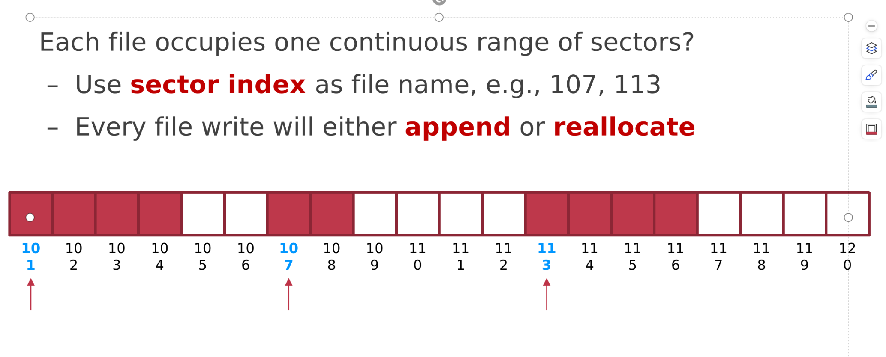

**Inode Layer design**

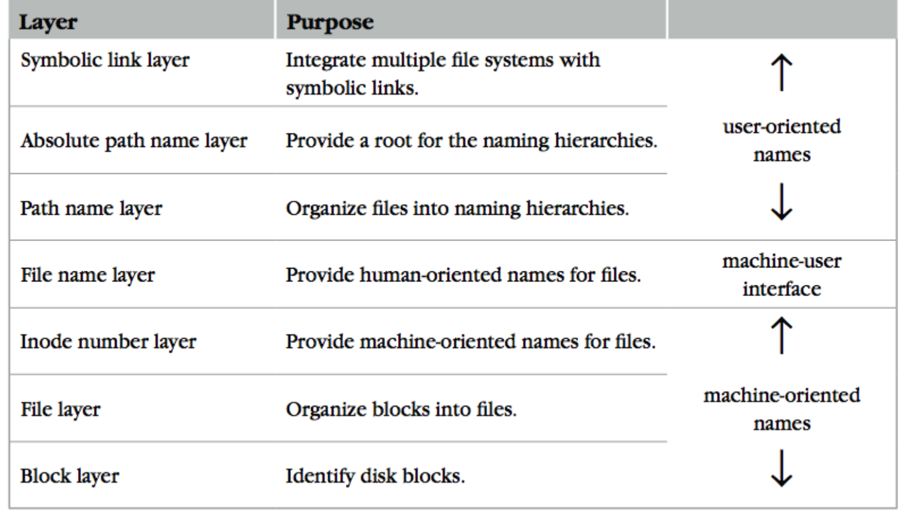

### L1: Block Layer

need bitmap for performance

need super block for metadata

- Size of the blocks
- Number of free blocks
- A list of free blocks
- Other metadata of the file system

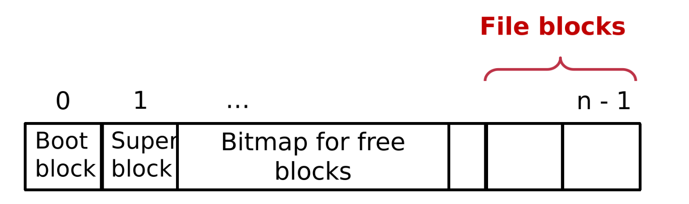

### L2: File Layer

Inode as an abstraction for file

```c
struct inode
  integer block_nums[N]
  integer size
```

store inode in blocks

considering large file, design indirect inode for scalability

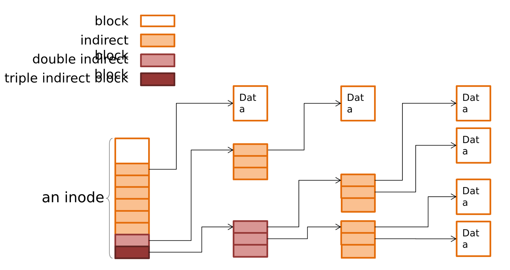

### L3: Inode number layer

add an inode table as index:

- at a fixed location on storage
- inode number is the index of inode table
- Track which inode number are in use

### L4: File name Layer

Mapping table is saved in directory

- map string to inode
- filenames are stored in directory data

- Default context: current working directory

add type to inode to support directory:

```c
struct inode
  integer block_nums[N]
  integer size
  integer type
```

Lookup func:

```python
procedure LOOKUP(string filename, integer dir)-> integer
   block b
   inode i = INODE_NUMBER_TO_INODE(dir)
   if i.type != DIRECTORY then return FAIURE
   for offset from 0 to i.size – 1 do
         b <- INODE_NUMBER_TO_BLOCK(offset, dir) 
         if STRING_MATCH(filename, b) then 
            return INODE_NUMBER(filename, b)
        offset <- offset + BLOCKSIZSE
   return FAILURE 
```

### L5: Path name Layer

Lookup string like: Structured naming "projects/paper"

**Links(Hard Link)**

link string to inode of another name

Dangerous: Users cannot create links to directories -> acyclic graph

APIs: LINK, UNLINK

changes:

- refcount in dir inode
- add/cut record in dir inode

**Renaming in text editing**

Text edit usually save editing file in a temp file

1. UNLINK(a.c) -> LINK(a.c.swp, a.c) -> UNLINK(a.c.swp)

2. LINK(a.c.swp, a.c) -> UNLINK(a.c.swp)

### L6 Absolute Path Name Layer

`/` is hard-coded as inode 1

### L7 Symbolic link Layer

issue: name between different disks

**Soft link**

link string to string

need external inode to store "to_link"

### Implement of APIs

- CHDIR, MKDIR
- CREAT, LINK, UNLINK, RENAME
- SYMLINK
- MOUNT, UNMOUNT
- OPEN, READ, WRITE, APPEND, CLOSE
- SYNC

**Real metadata in inode**

permission ans timestamp

```c
struct inode
  integer block_nums[N]
  integer size
  integer type
  integer refcnt
  integer userid 
  integer groupid
  integer mode
  integer atime
  integer mtime
  integer ctime
```

**Open**

- Check user's permission

- Update last access time
- Return fd

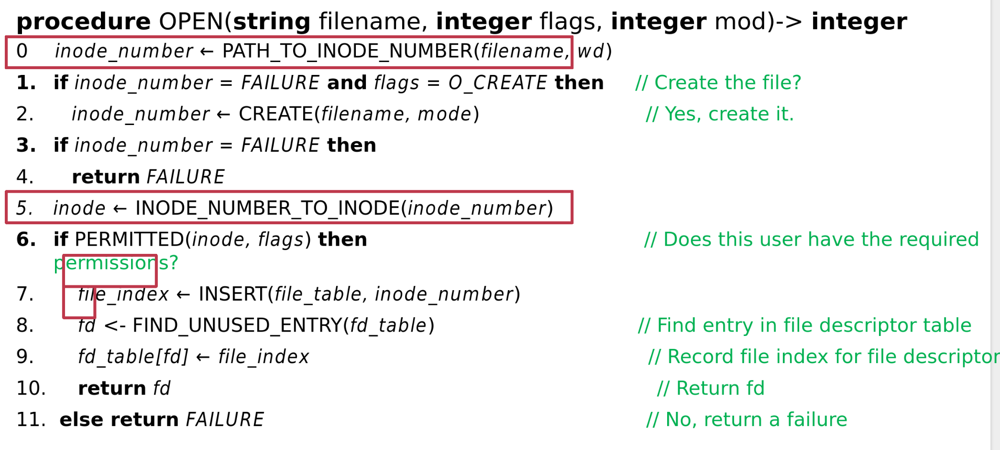

**FD & File Cursor & File table**

fd

- reserved: 0, 1, 2
- process exclusive
- instead of inode and fs data for
  - security
  - kernal management

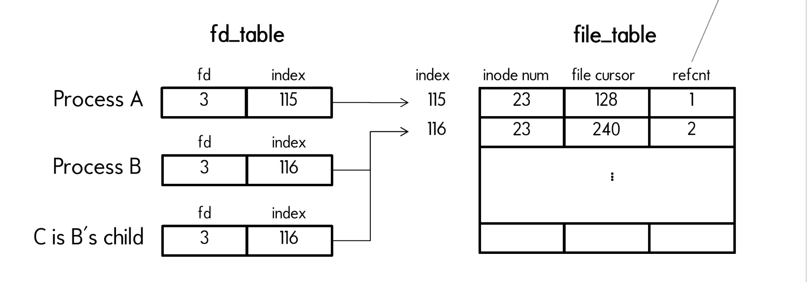

**Read**

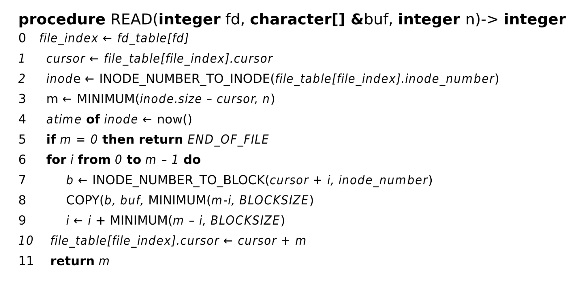

**Write, Append**

- Allocate new block if necessary

- Update inode's size and mtime

Problem: Failure

- Update block bitmap -> write new data -> update inode (size and pointer)
- update inode is dangerous, this causes unreferenced data but safe

**Close**

- Free the entry in the fd_table
- Decrease the reference counter in file table
- Free the entry in file table if counter is 0

**Sync**

Caches in memory

- Cache of recently used disk blocks
- Read from disk if cache miss
- Delay the writes for batching
- Improve performance
- Use Sync to void: cause inconsistency if fail before write

**Delete after open**

- The inode is not freed until the first process calls CLOSE

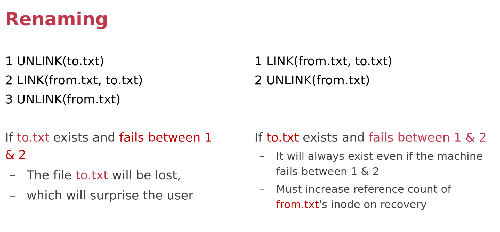

**Examples**

Read

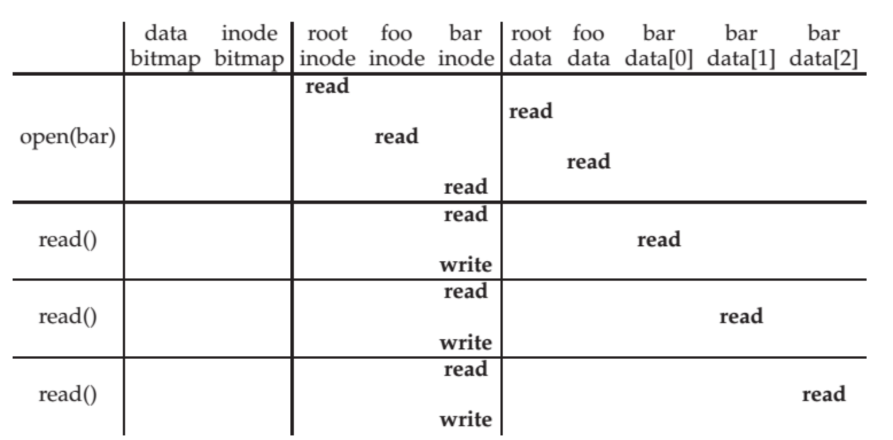

Creat

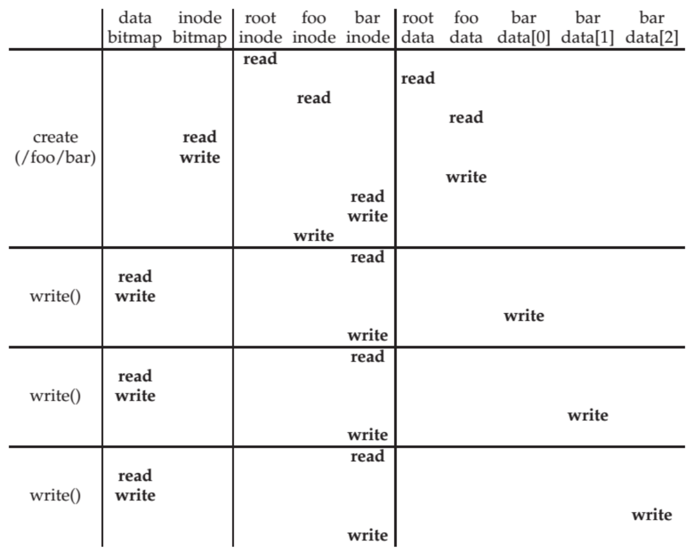

## FAT fs

# RPC

## Why RPC

Allow a procedure execute in another address space without coding the details for the remote interaction

**RPC vs. socket**

socket deeply rooted in application, unbinding is needed.

RPC is similar to PC which provided by remote server 

**Stub replace non-semantic web communication**

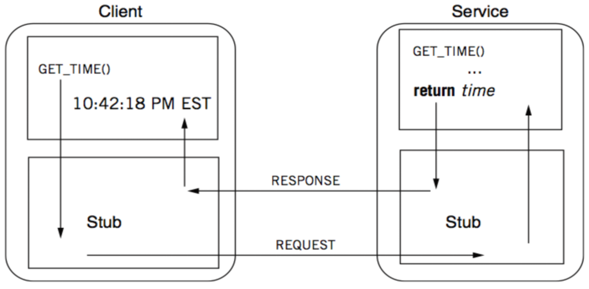

## RPC impl

**Using marshal?**: Serialize! How to queue pointed data properly

**RPC request:**

- Xid (X: transaction)
- call/reply
- rpc version
- **program #**
- program version
- **procedure #**
- auth stuff
- **arguments**

**RPC reply:**

- Xid
- call/reply
- accepted? (Yes, or No due to bad RPC version, auth failure, etc.)
- auth stuff
- success? (Yes, or No due to bad prog/proc #, etc.)
- **results**

## Data Encoding

**Design Rules**

- Compatible: different devices
- Evolvable: version compatible 

**Some solution**

- json/xml: readable, but low efficiency
- Java's java.io.Serializable: only java

**Protocol Buffer & Thrift**

super light binary format, ignore field name!

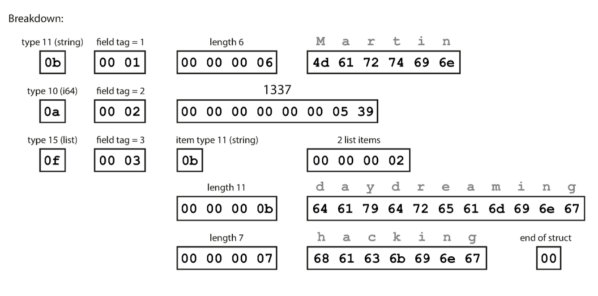

## Failure Handler

dilemma: web service failure


### RPC semantic

we need exactly once

**at least once:**

- retry many times

**at most once:**

- idempotence: x=1;non-idempotence: x++

### Impl

- Client retry if timeout

- For non-idempotence move, maintain a counter in server.

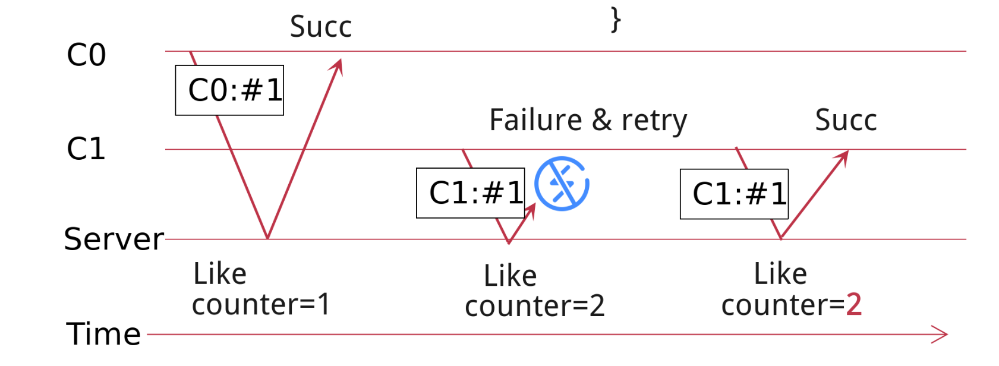

# NFS

## Why use NFS to access remote file

Inside stub, there must be efficient way

- Using mainly **file copy**: FTP, telnet...
- remote access model: transparent and diskless

NFS implements features of remote access, but with a lot optimization

- diskless
- transparency with remote access model
- stateless
- caching

## NFS impl

Similar to inode API

**Abstraction**

- server share specific local file

- client mount ip:/path/to/file

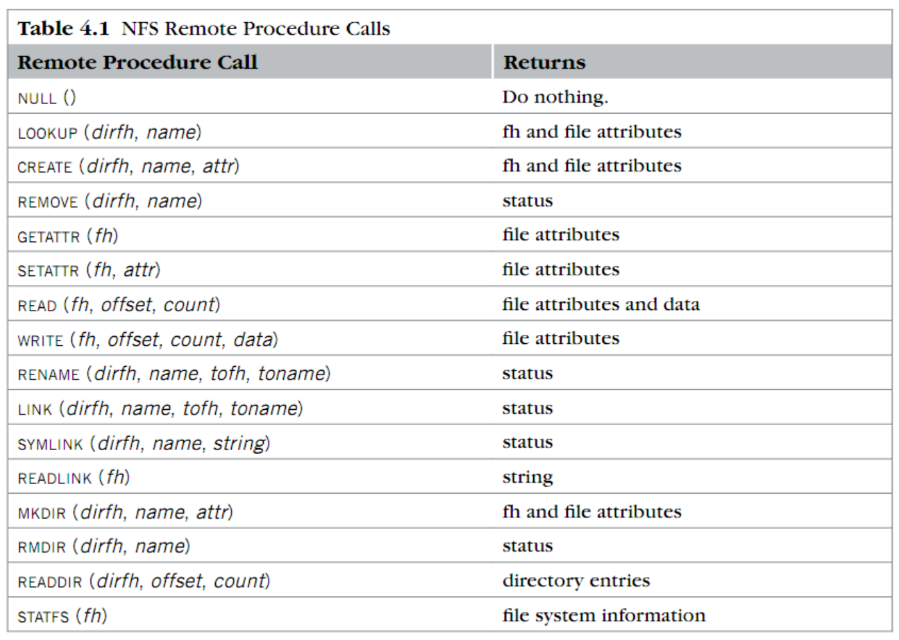

### No open and close in NFS

open and close need to be maintained by client -> keep RPC server **stateless**, avoiding failure

### What's in fh

- filename: cannot handle rename
- inode number: what if a file is updated

Use inode number & generation number

### Performance Overhead

Server FS performance & **Network Speed**

- use client cache to reduce network cost
  - filedata
  - metadata
  - pathname - inode binding

**Caching**

- close-to-open consistency: 
  - **Flush** the cache upon close
  - **Mark dirty** when modifing file
- read/write conherence
  - keep timestamp to **validate** data
  - auto invalidate data

**Chunks Reading**

**Read-ahead**

## GFS

**Specific environment**

- huge and frequent read

- appending rather than overwrite
- favor fault tolerance

**Many distributed file storage chunks and A metadata master** 

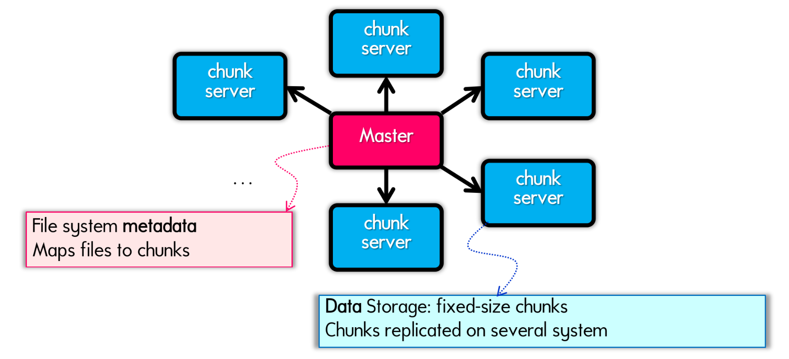

**Features**

- chunk: primary and replicas
- master: in-memory metadata
- logs: for restore


**Why large trunk server (64MB)**

- Fewer read
- Fewer TCP connection but longer
- Smaller metadata: Master can store metadata in memory

**In one word, more flat, more specific and safer.**

# KVStore

**Extract function for more specialized performance**

- Get(K) -> V
- Scan(K,N)
- Update(K,V)
- Insert(K,V)
- Delete(K,V)

## System modeling

Build an internal abstraction of the system, distill the main components that determine the system behavior

- clarify requirement

Can be parameterized

- input param: kv sizes
- static param: disk read time
- runtime param: complex context

## KVStore impl

### Step 1: All in one file

**consider update**

- directly modify the file content: run random write
- append the new updates to the last of the file: append to end of file, sequential write

So append is better, due to disk feature

### Step 2: Log-Structured KVS

append-only

- delete: append null value

- insert: append new value
- **get: slow! Have to go through all!**

### Step 3: +index

maintain an external index

- use hash table as index
- get: O(1)
- Problem: index must be in RAM

### Step 4: in-memory and disk hybrid index

Fat pointer, store both pointer and **offset to disk index**

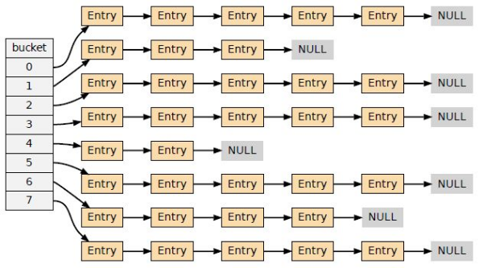

Brings disk overhead

- Optimize with Cuckoo hash, in order to minimize lookup

**Fix: Prevent Duplicate forever**

merge and remove duplicated record in **compaction**

### Step 5: B+Tree-based KVS

Use B+Tree to **support scan query**

Problem remains:

- random disk I/O -> unsorted
- slow get -> lookup all
- large index size

### Step 6: SSTables KVS

file -> fixed-sized **sorted, immutable** segments

- also use compaction
- Still need to lookup all

### Step 7: LSM Tree

Multi-level, Hierarchy tree

- sorted in every level

**Handle Failure**

about memtable, maintain a log before write

# Consistency

## Attempt 1: Centralized server

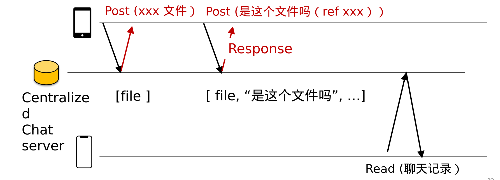

Problem:

- linear, slow and heavy
- cannot support offline
- one server, vulnerable

## Attempt 2: Replicated server

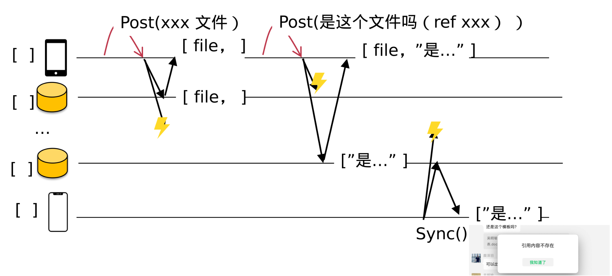

**Problem & Impl**

- update to local first
- post to all in sync: slow
- post to only partial: some server holds outdated data
- add sync request to other server: but how
- sync with partial servers, merge data

**Sync bring reorder**

## Attempt 3: Build Consistency model

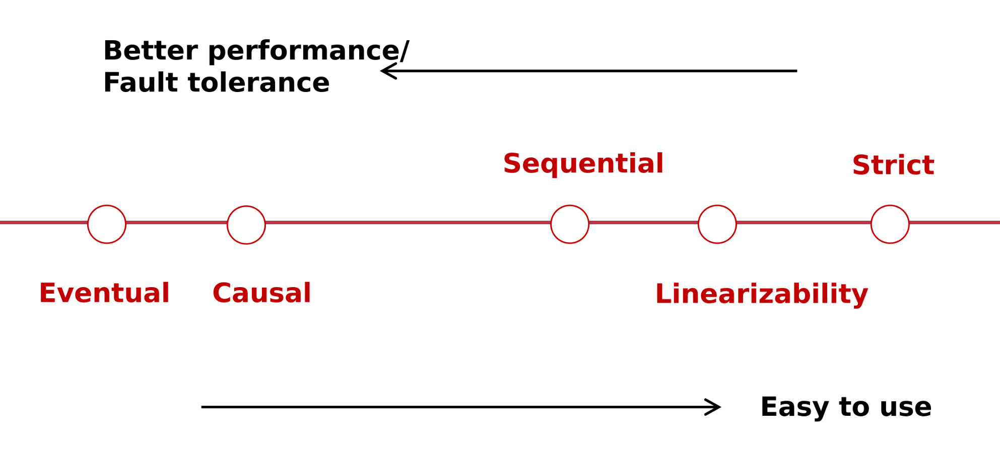

choose specific model depending on your needs

**Wechat APP needs Eventual Consistency**: 

## Eventual Consistency

- efficiency first, weak consistency
- If no new updates are made to the data, eventually all accesses will return the last update value 
- Read: return the latest local copies of the data
- Write: write locally (and directly returns), propagate the writes to all the servers in background

### Deal with Order

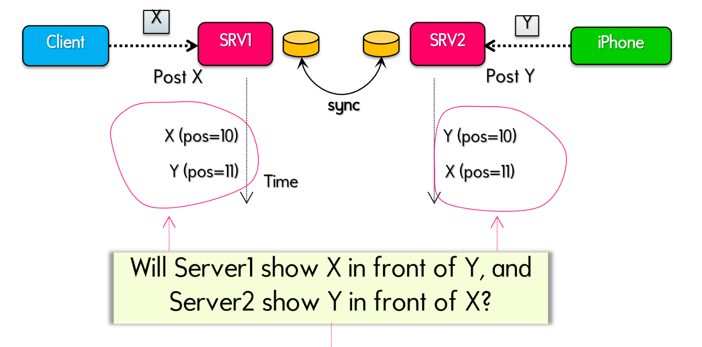

record time and sort by time, then replace local data

**So record which time?**

- actual time of local device
  - **total order**: every event is sorted
  - real time may equal, not comparable 
- compare both time and node_id
  - 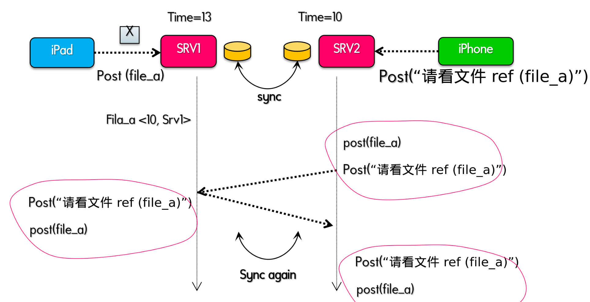
  - eventually consist, comparable
  - while real time differ between node
- Use what timer
  - atom clock is a accurate timer
  - don't stick with time, **focus on causal**

### Lamport Clock

- node: If event #1 and event #2 are created on the same node, and event #1 is before event #2
- cross-node: TS(event #1) < TS(event #2), #1 cause #2

**Implement**

1. each node holds its own time T
2. update $T = max(T, T'+1)$ when sees another T'

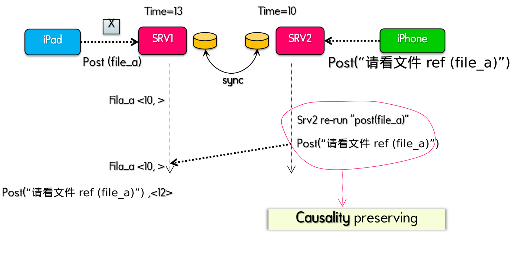

**Problem**

- **rely on communication** to be chronic
- Hybrid clock( hold both T and physical time)

### Partial Order

Sometimes we need Partial order, when there isn't necessarily an causal order 

Strong order is needed

**Vector clock**

- record more than one Ts
- increment own bit

- similar to lamport clock: apply to every bit in vector when synced

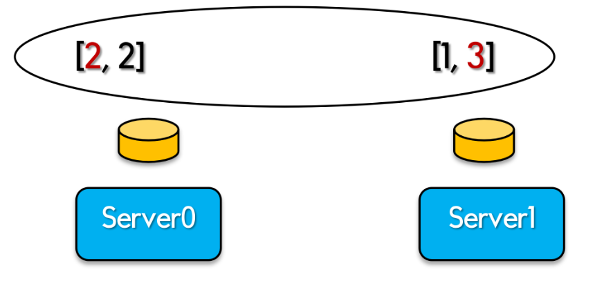

## Stronger consistency: Linearizablilty

**One naive solution: Centralized server**

must take network overhead in account

how to extend to distributed system

### Primary-backup model

- Write to all the replicas in async way
- write to local and response
- add seq number to avoid network reorder in replicas

**Problem**

- poor performance
- reliability

**Optimize**

- read local copy
- not linearizable

# Atomicity

Naive case: use fsync to support persist

```
bank.modify1()
bank.modify2()
fsync(bank)
```

**Problem: partial failure in fsync**

take failure into account

Transaction, or **all-or-nothing**, avoid partial process

**Use Shadow copy**

- keep the original data

```
fcopy(bank, bank_temp)
bank_temp.modify1()
bank_temp.modify2()
fsync(bank_temp)
bank = bank_temp
```

consider rename, brings problem

- link and unlink is not atomic
- Two names point to fnew’s inode, but refcount is 1

solution: ask application to delete "bank_temp"

## Use Journaling

Add some steps before update, save journal in fs

- Record **data** changes in journal
- Commit journal

Drawbacks

- double write, slower
- problematic with large file

Mitigation:

- Only protect metadata not data
- with important data, enable an option "journal"

Journal write is also crashable

- hardware provides atomic writes

**Shadow copy don't support concurrent ops** 

- multiple different bank_temp, need merge rather than update
- so no concurrency
- hard to generalize to multiple files
- file copy is costly

## Use Logging


storing all the updates in a log

**Compared to journal:**

| 方面         | **Log**（日志）                 | **Journal**（日志文件/日志区）        |
| ------------ | ------------------------------- | ------------------------------------- |
| **作用范围** | 记录事务操作、数据变化          | 记录文件系统元数据（甚至数据）的修改  |
| **写入内容** | application transaction         | record block update                   |
| **恢复方式** | 通过 REDO / UNDO 恢复事务一致性 | 通过回放 journal 来恢复文件系统一致性 |
| **粒度**     | 通常以事务为单位（逻辑日志）    | 通常以磁盘块为单位（物理日志）        |

### Redo-Only Log

log-entries: record operation

**Commit point & Transaction**

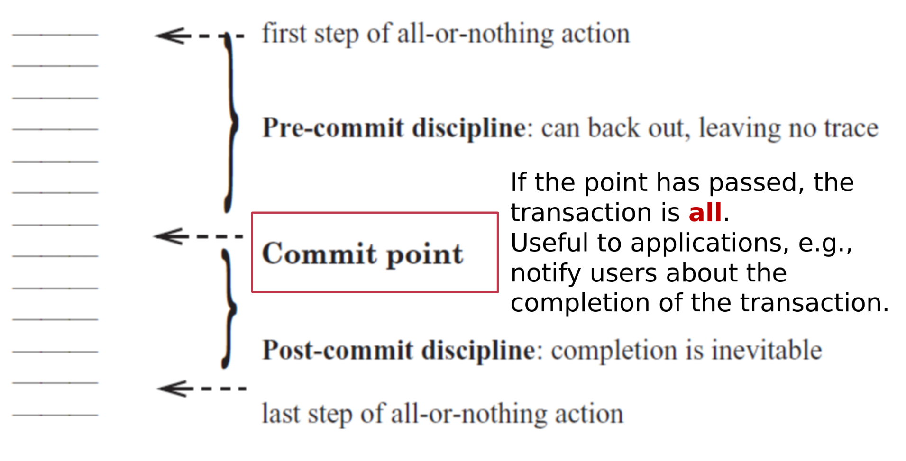

- provide **interface TX()** to mark ops in need of all-or-nothing

- **commit point** is used to commit the TX() ops all together

**After Crash**

- redo: recover from log

```python
transfer(bank, a, b, amt, log): // amt=10
    records = mmap(bank, ...)
    new_a = records[a] – amt 
    new_b = records[b] + amt 
    
    commit_log = "log start: a:" + new_a + "\b:" + new_b
    log.append(commit_log).sync() 

    record[a] = new_a
    record[b] = new_b
```

**Pros and Cons**

- fast, only ops appended
- may eat up memory, causing swapping
- swap is bad and waste storage
- grow forever

### Undo-Only Log

log records: old value

```python
transfer(bank, a, b, amt, log): // amt=10
    records = mmap(bank, ...)
    log.append(...).sync() 
    records[a] = records[a] – amt
    log.append(...).sync() 
    records[b] = records[b] + amt
```

### Undo-redo Log

undo log is transaction-linked

redo log is just piggy-tail

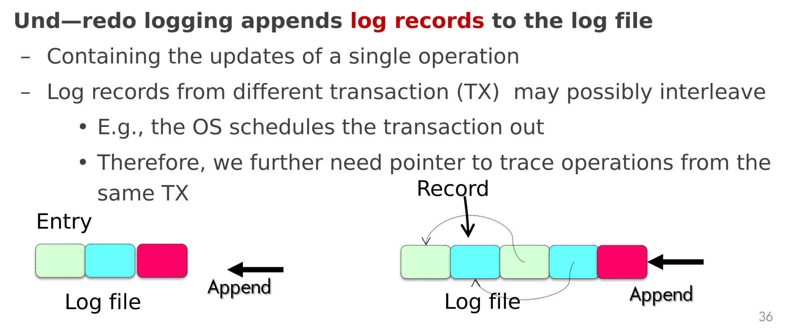

**Recovery rule**

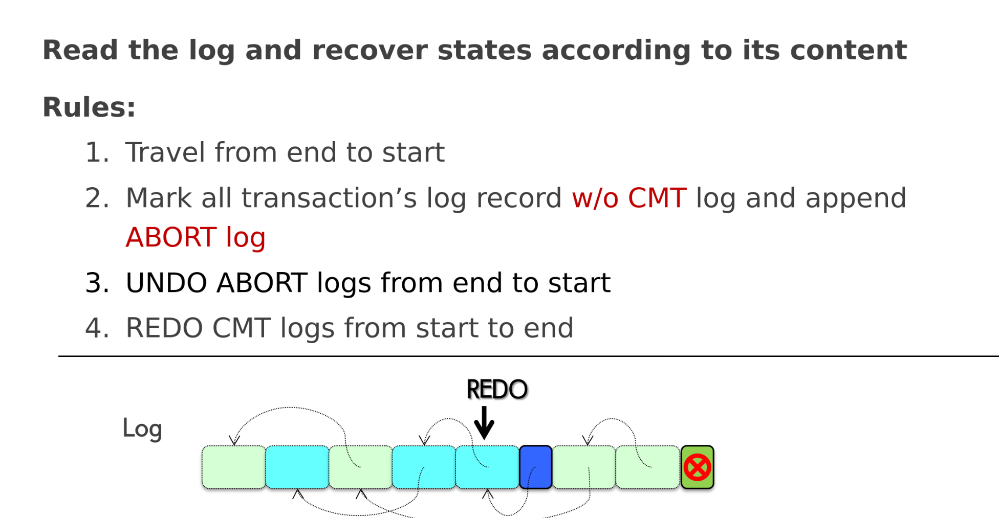

**Compared with redo-only**

redo-only is faster in both exec and recovery, but undo-redo solves memory problem

## Use Checkpoint

deal with growing forever

Save the system state to a compact form such that the re-execution (restore) is faster

- add CKPT record in log

- Flush page cache only, because in disk transaction is all done

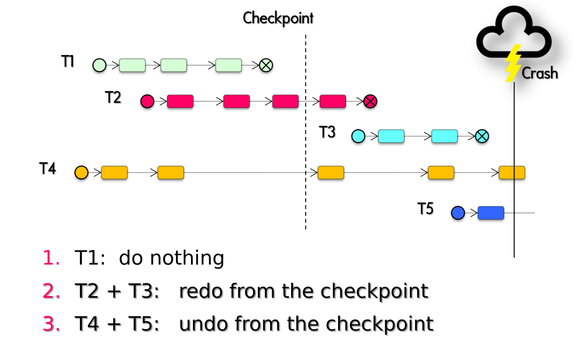

### Discuss eventual consistency again

After sync, local device should record the updates in a log, and do.

use checkpoint to avoid log growing forever

**Challenge: log cannot be erase since sync is not instant**

- distinguish stable writes with tentative ones
- De-centralized: use lamport clock, **after a full sync**, determine the min(T) as stable time
- so stable logs are discardable

**Optimize with centralized:** 

- select a **primary** server and assign a total commit order

- actively commit a determining timestamp overtime

- problem: commit is not causal
- solution: commit with primary in batch

# Concurrency

**Problem 1: limited throughtput**

use concurrency

**Problem 2: race condition**

design a strong consistency for read/write: before-and-after

## Lock

**Global lock**

lock no matter what data involved

drawback: performance

**Fine-grained lock**

each data with a lock

drawback: still race condition

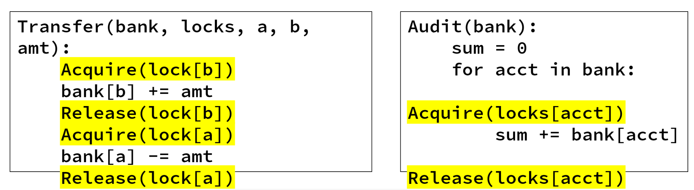

### 2PL

In one action, once release a lock, never acquire new lock

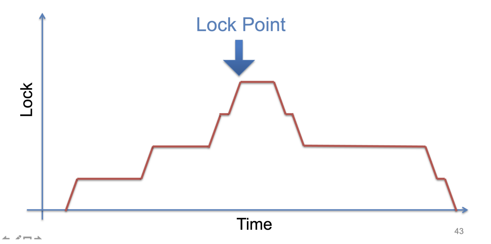

**Why before and after**

By **Conflict serializability**, it appears to ran sequentially

- View Serializability: all the read/write have same output as serial

- Conflict Serializability: use graph to analyze
  - Nodes are transactions
  - Edges are conflict
  - acyclic means serializable

conflict is more strict, so conflict must ok, but non-conflict may also be ok

**Phantom Problem**

implicit conflict, cannot be easily locked

**Deadlock**

typical in 2PL, wait forever

A acquire lockA and wait for lockB; B acquire lockB and wait for lockA

Solution:

- pre-define an order for data: Dining philosophers problem
- detect by calculating the cycle in graph: abort a TX
- just abort long-running TX

## Optimistic Concurrency Control

no lock, overcome deadlock

- Phase 1: buffer write set and read set
- Create a critical section: validate serializability in read set when commiting
- ok ? commit : abort

Validate with TX **version** rather than value

```python
# read
val_a = read(A)
read_set.add(val_a)

# validate and commit
for d in read_set:
   if d has changed:
      abort()
for d in write_set:
   write(d)
```

**Problem**

atomic in buffering

before or after in committing

**Solution**

Still use 2PL in critical stage, and use sort to pre-order

```python
    for d in sorted(read-set + write-set):
        d.lock()
    for d in read-set:
        if d has changed:
           abort()
    for d in write-set:
        write(d)
    // release the locks
```

Optimize: read-set is implicitly locked, so read-set lock can be saved

ensure read-set cannot be locked

```python
    for d in sorted(write-set):
        d.lock()
    for d in read-set:
        if d has changed or d has been locked:
           abort()
    for d in write-set:
        write(d)
    // release the locks
```

**Advantages**

- Faster: OCC more reads and less writes
- Faster: OCC less lock

**Problems**

- unnecessary abort
  - 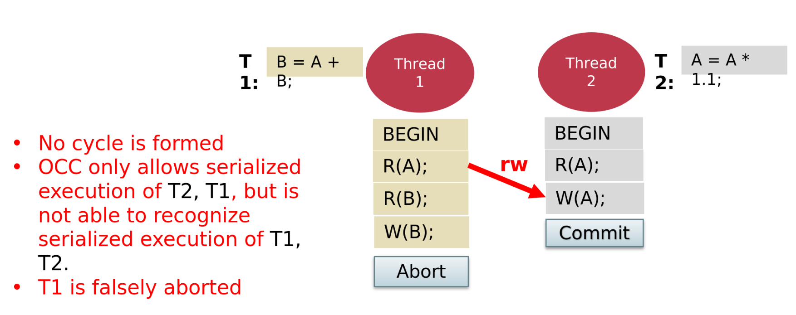

- live lock
  - constantly abort and retry, change to 2PL

## Branch Optimize

Fast path & slow path

**Case of training**

fast path with small model generate

slow path with large model validation in batch

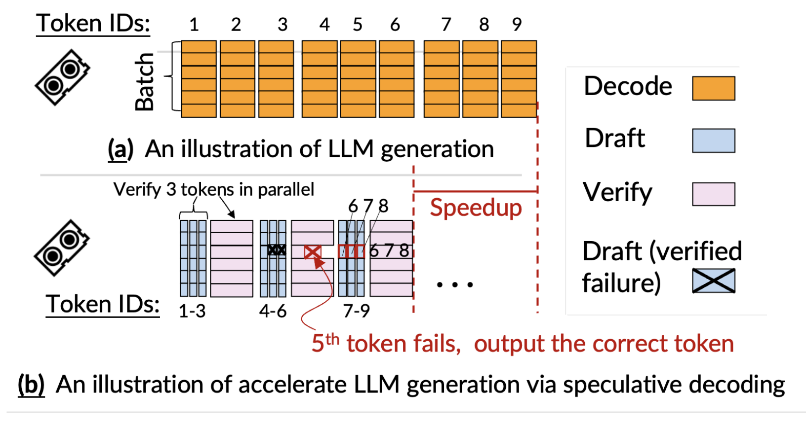

## Hardware TX

Intel RTM

...

## TX feature

## Multi-version CC optimize

minimize OCC abort times

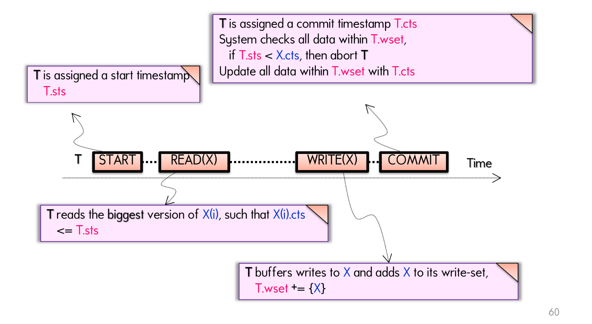

sometimes it's consistent but version varies

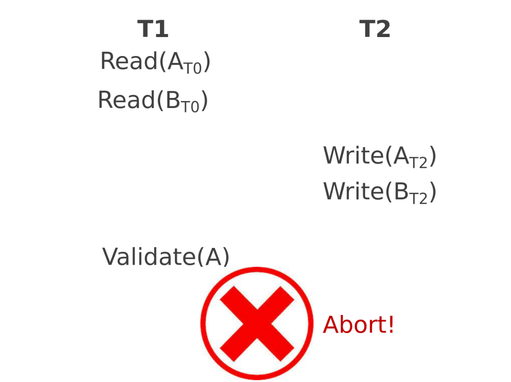

**Versioned Data**

from data to:

```java
Struct Data {
 value: List<VersionedData>
 lock : lock_t 
}

Struct VersionedData {
 value: u8[…]
 version: u64
} 
```

For Read:

- read from a consistent snapshot at specific version

For write:

- don't overwrite but add a snapshot

**How to determine version**

global counter: get timestamp when a TX start and commit

Use Fetch And Add Atomic

?physical clock: hard to do

**Impl optimized OCC**

```python
Commit(tx):
   for record in tx.write_set: 
       lock(record)
   let commit_ts = FAA(global_counter)
   for record in tx.write_set:
       record.insert_new_version(commit_ts, ...) 
       unlock(record) 

Get(tx, record):
   while record.is_locked():
         pass
   for version,value in record.sort_version_in_decreasing():
       if version <= tx.start_time: 
          return value
```

Partial failure solution

In write: FAA and write must be atomic, otherwise read may run between them, so use LOCK

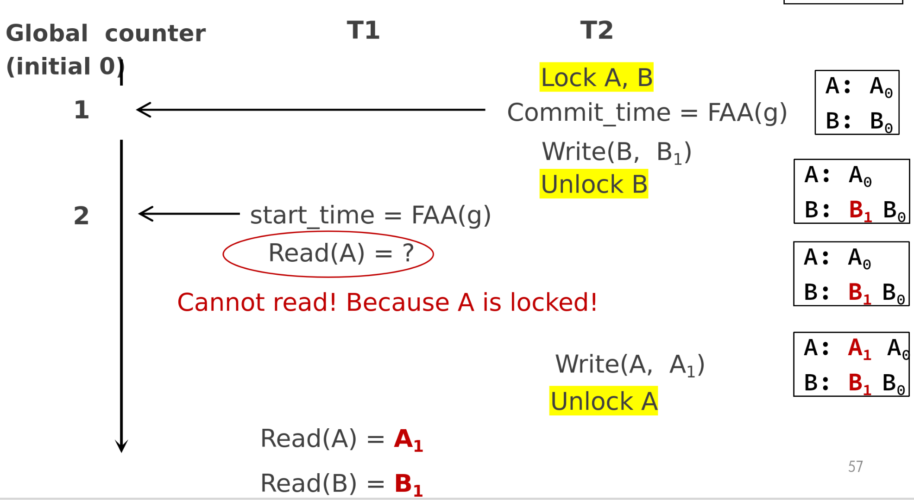

**Advantages**

don't validate read, faster

but not strictly before-or-after

**Write skew anomaly**

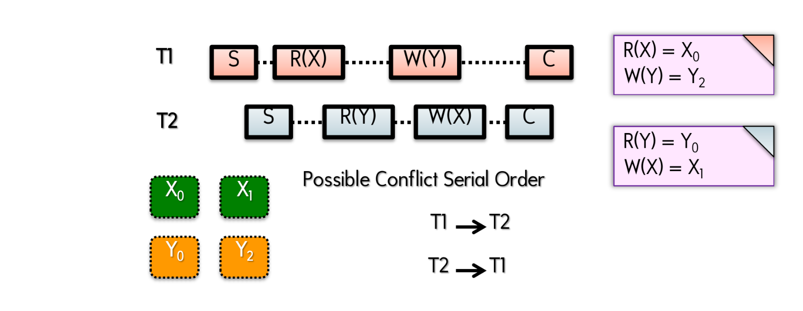

Fix by fallback to OCC when read/write

## Multi-site TX

### 2PC

aim to solve this

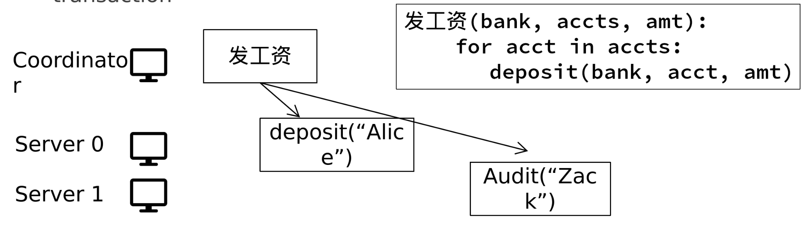

design 2PC: higher-layer and lower-layer TX

**Phase 1**

preparation / voting: lower-layer TX either abort or tentatively commit

**Phase 2**

commitment: coordinate aborts and commits


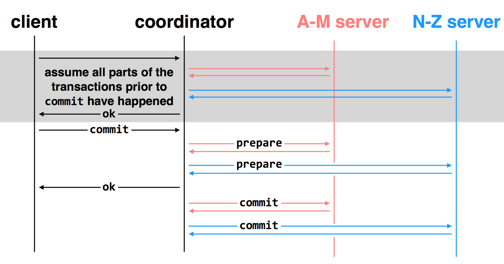

**Problem**

poor availability in many case:

- prepare sending/receiving: just resend
- prepare processing: abort or wait for reboot 
- abort sending/receiving
- commit sending/receiving
- coordinator error

**Principle**

- every modification is decided by coordinator
- add RPC to server to ask coordinator
- Log sufficient state to tolerate failures

before commit, only 2 case:

- Collect some ABORT or nothing: ABORT or retry
- Collect all COMMIT: then COMMIT

**Tricky thing about lock**

coordinator may fail

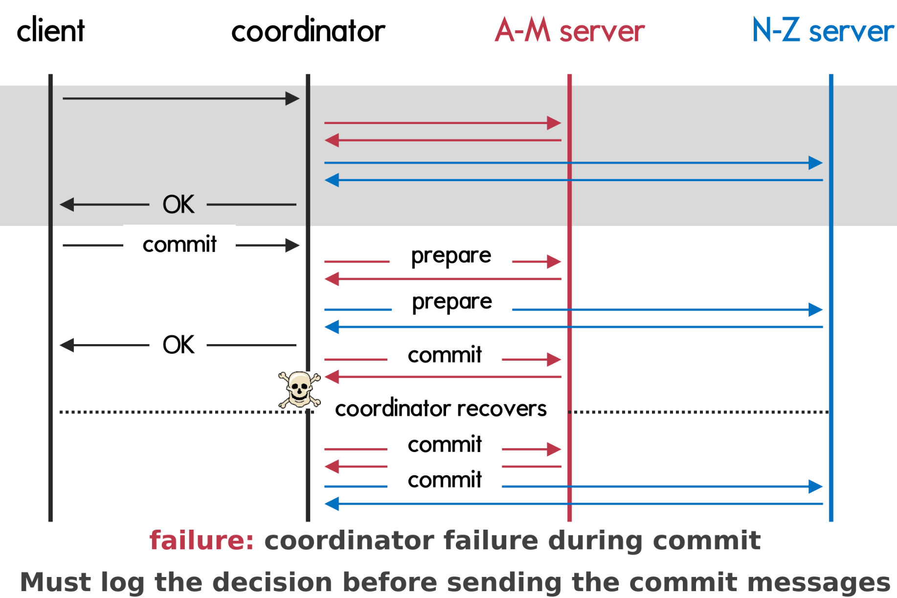

### Replication

2PC is consist, but poorly available

so use replication

- clients send request to all replicas
- serve more clients
- high fault tolerance

Order issue

- Optimistic: fix eventually
- Pessimistic: linearizability (prefer this in multi-site)

**Primary-backup model**

Replicated state machine (RSM)

must solve availability issue

add a coordinator to arrange primary and backup

**Assume coordinator don't fail**

select primary dynamically

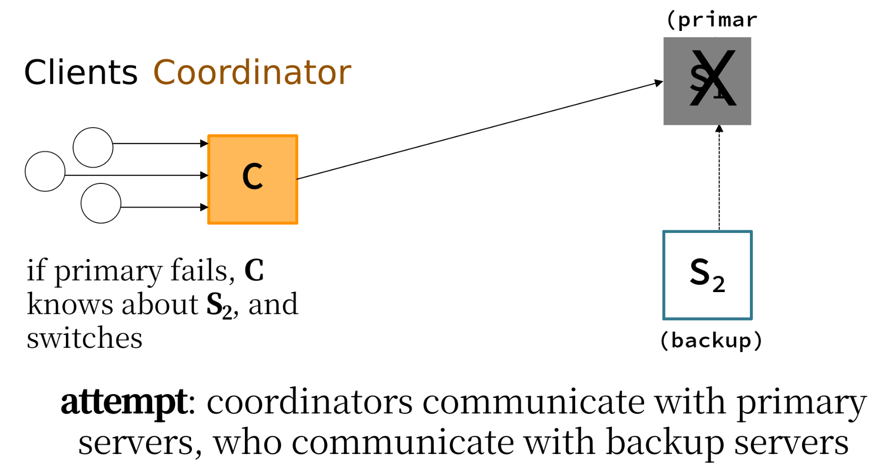

coordinator may fail, so replicate coordinator

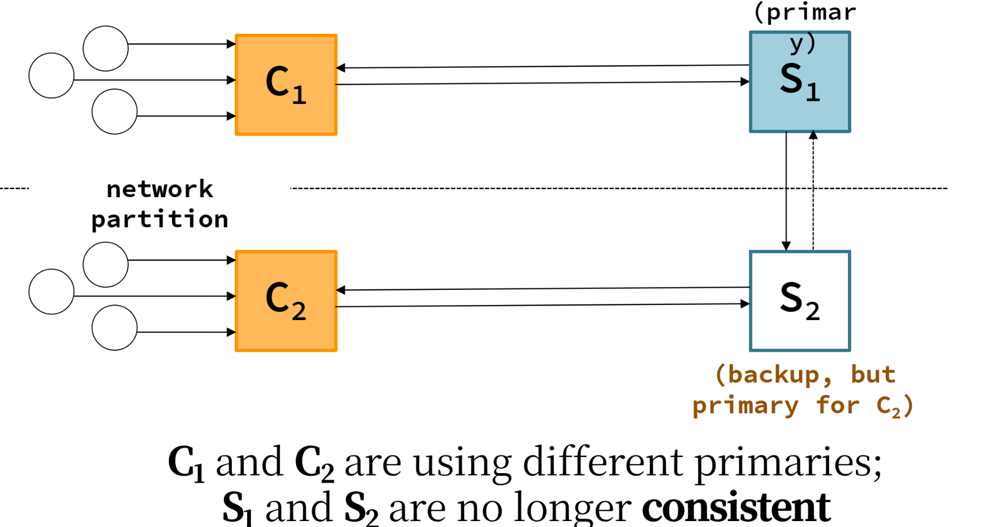

Network partition causes split brain

**View server**

keep a primary and backup versioned record

Before

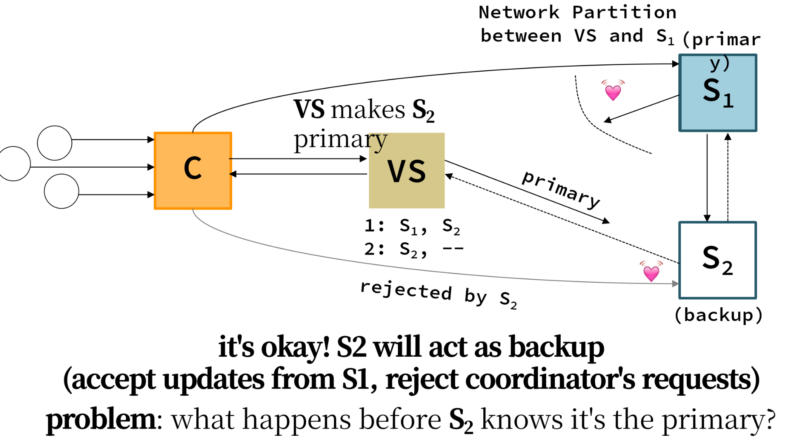

After

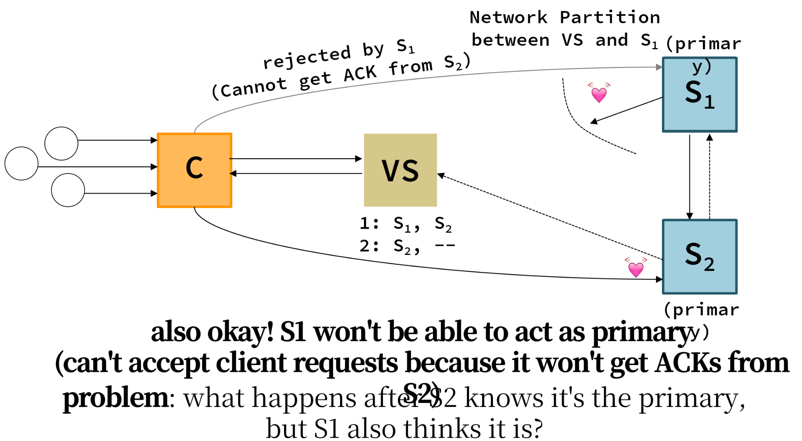

**What if backup fail, use Quorum**

assumption: only one writer

primary rely on all backup's ACK, backup fail means  primary mismatch

ensure Qr and Qw > Nrepilcas, reduce ACK from n to Qr

### Paxos

make sure only one writer

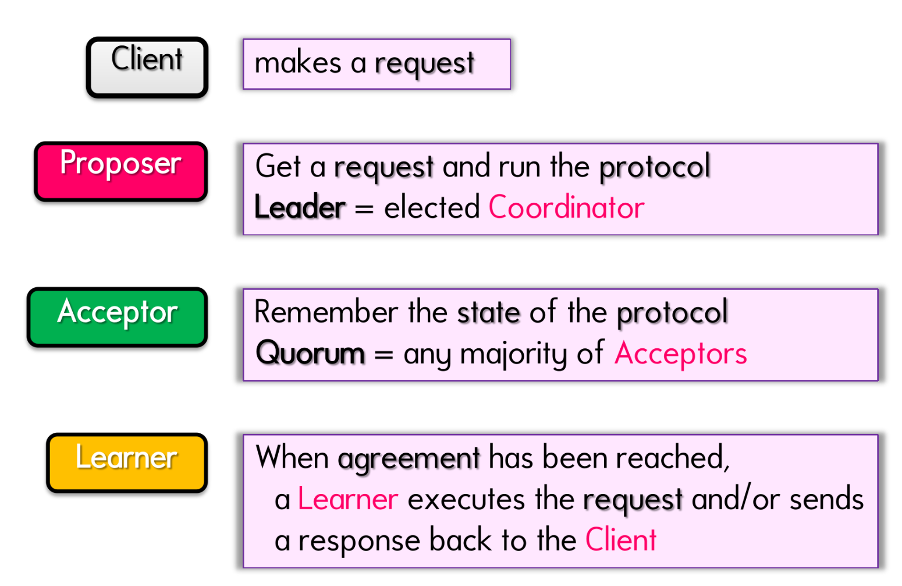

Machines keep record of:

- Mn: my proposal number
- Va: accepted value of Na (Value agreed on)
- Na: highest proposal number accepted
- Nh: highest proposal number seen

**Phase 1**

- requested proposer becomes leader, leader create **proposal N** and send to Quorum
- Accepter judges:
  - reject if ID <= previous proposal
  - if ID > previous ones, reply <promise, N, V=null>
  - Promise to abandon ID < N

**Phase 2**

- Leader check received promise, if enough(half+1)
  - choose a V, from Va or random is all Va == null
  - send **<accept, N, V>**
- Accepter judges again:
  - if the promise is gone, ignore
  - register V and send accepted message

**Illustration**

Normally

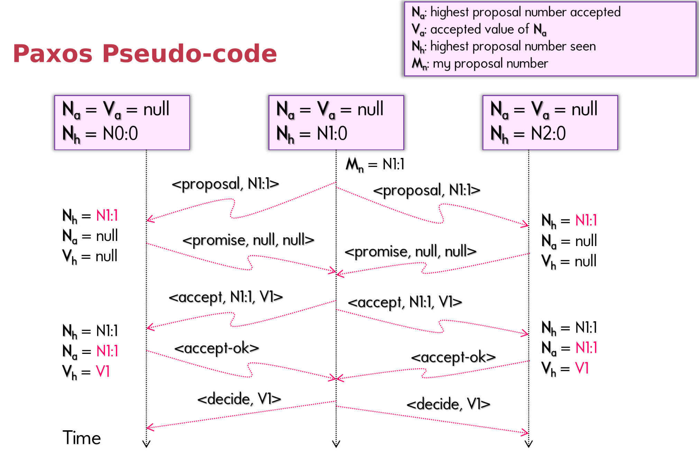

Failure

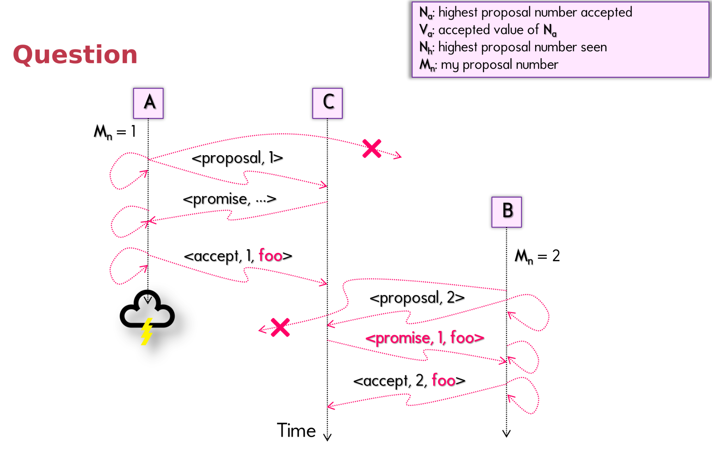

### Multi-Paxos

determine a value one by one through multiple rounds of Paxos

which is so inefficienct

**Optimize: leader election**

from prepare stage

if only one proposer is proposing(mostly), **batch prepare** and send only once

**Problem: hole in the log**

when the only leader crashes, log will be blank

# Networking

## Basic Concept

Networking Layer  Design

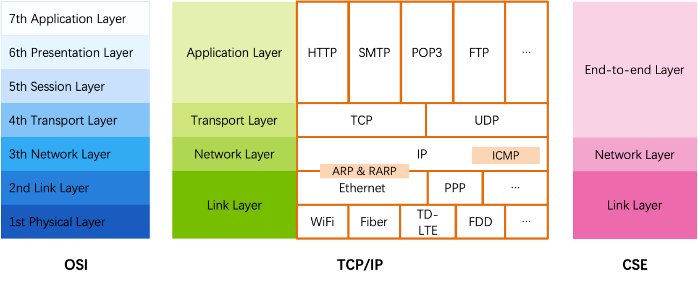

CSE Layer

- Link Layer: Moving data directly from **one point to another**
- Network Layer: Forwarding data through **intermediate points** to the place it is wanted
- End-to-end Layer: provide a comfortable application interface

**Data Packet**

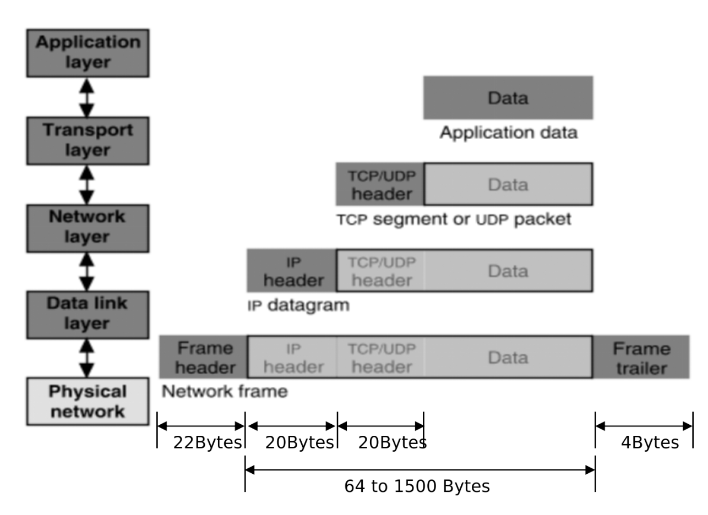

## Link Layer

### Physical transmission

**Demand**

transmit data without sharing a clock

**Solution: Three-wire ready/acknowledge protocol**


# Upper Network Level

## DNS

Link Domain name to IP addr, similar to filename and inode

**Features**

- One Name to multiple IPs: server-side **load balance** & client-side **nearest IP** to access
- One IP to multiple name: for server consolidation
- corresponding relation change: dynamic update in machine everyday

### Look-up Algo

**Naive algo**

Store a table: "my-domain 202.120.224.83"

Poor scalablility

#### How BIND do

- Key idea: Hierarchy to scale
- 


